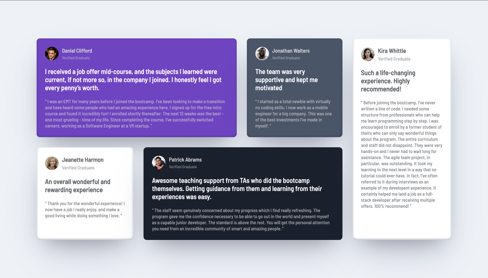

# Frontend Mentor - Testimonials grid section solution

This is a solution to the [Testimonials grid section challenge on Frontend Mentor](https://www.frontendmentor.io/challenges/testimonials-grid-section-Nnw6J7Un7). Frontend Mentor challenges help you improve your coding skills by building realistic projects.

## Table of contents

- [Overview](#overview)
  - [The challenge](#the-challenge)
  - [Screenshot](#screenshot)
  - [Links](#links)
- [My process](#my-process)
  - [Built with](#built-with)
  - [What I learned](#what-i-learned)
  - [Continued development](#continued-development)
  - [Useful resources](#useful-resources)
- [Author](#author)
- [Acknowledgments](#acknowledgments)

**Note: Delete this note and update the table of contents based on what sections you keep.**

## Overview

### The challenge

Users should be able to:

- View the optimal layout for the site depending on their device's screen size

### Screenshot

### Links

- Solution URL: [https://github.com/Divjas-Singh/Testimonials-grid-section](https://github.com/Divjas-Singh/Testimonials-grid-section)
- Live Site URL: [https://divjas-singh.github.io/Testimonials-grid-section/](https://divjas-singh.github.io/Testimonials-grid-section/)

### Built with

- Semantic HTML5 markup
- CSS custom properties
- Flexbox
- CSS Grid
- Mobile-first workflow
- [Styled Components](https://fonts.google.com/) - For styles

### Useful resources

- [resource 1](https://www.w3schools.com/)
- [resource 2](https://developer.mozilla.org/en-US/docs/Web/CSS)

## Author

- Frontend Mentor - [@Divjas-Singh](https://www.frontendmentor.io/profile/Divjas-Singh)
